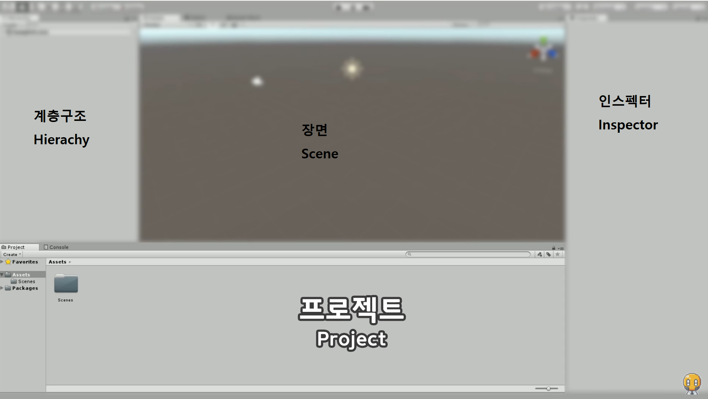

https://www.youtube.com/watch?v=lYzGTUJxPDQ&list=PLO-mt5Iu5TeYI4dbYwWP8JqZMC9iuUIW2&index=2

유니티 인터페이스에 대해 알아보자.

유니티 실행 - 프로젝트 - 오른쪽 상단에 새로운 프로젝트

버전, 위치, 3D 이런거 선택 가능.

설치하는 데에 시간 조금 걸린다.

### 유니티 에디터

기본 인터페이스는 4개의 창으로 구성

- 프로젝트

게임을 구성하는 파일들, 그래픽, 사운드 모두 프로젝트 창에 들어간다.

- 계층구조

게임 오브젝트를 확인하거나, 직접 만들 수 있다.

- 장면

게임 오브젝트는 장면 창에서 우리 눈에 보이게 된다.

- 인스펙터

게임 오브젝트들을 선택하게 되면, 인스펙터 창에서 속성들을 확인할 수 있다.

게임 오브젝트를 만들어보자.

계층 구조에서 오른쪽 마우스 클릭 - 3D Object - Cube로 큐브 생성

큐브 더블클릭하면 확대 삭 해줌

### 사물 조절하기, 시점 변화

q누르고 마우스 드래그 - 화면 움직이기

w누름 - 큐브 누르면 안에서 커서가 나온다.

화살표 누르면 이동 가능

E - 회전

R - 크기

x, y, z축 조절 가능, 원래 비율대로 조절도 가능.

T - 사각툴

3D보다 2D, UI에 적합

오른쪽 마우스 드래그 - 카메라 회전

제자리에서 카메라 회전

Alt + 카메라 왼쪽 버튼 누른 채 이동

카메라 축 이동

우리가 보고 있는 사물 기준으로 카메라 이동

화살표 - 카메라 자유이동

마우스 휠 - 카메라 줌 가능.

본격적으로 게임을 개발하기 위해서는 프로그래밍이 필수이다.

프로그래밍 공부한 뒤 유니티 에디터로 돌아오자.

