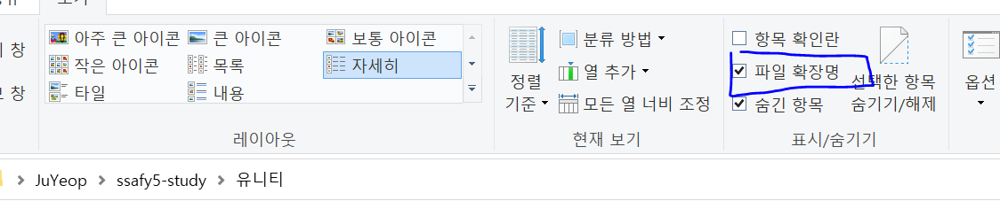

https://www.youtube.com/watch?v=1QyynHJ-3Ec&list=PLO-mt5Iu5TeYI4dbYwWP8JqZMC9iuUIW2&index=4


프로그래밍 학습에 앞서 준비물 챙겨보고 메시지 띄워보자.


첫 번째 준비물: C# 스크립트


마우스 프로젝트 창 빈 공간에 놓고 우클릭 - Create - C# Script


파일 이름 정해지면, 잠시 후에 인스펙터 창에 미리보기가 된다.


파일 더블클릭 - 두 번째 준비물인 비주얼 스튜디오가 나온다.

[난 연동을 안시켜놔서 메모장이 나온다..]


꿀팁) .cs 파일 vscode와 연동시키기

0. visual studio 설치

1. 아무 폴더에 text 파일을 만든다. test.cs.txt 이런 방식으로
2. 폴더에서 보기 - 파일 확장명 체크



3. 파일의 이름을 test.cs로 바꾼다.

   - 파일의 확장명을 변경하면 사용할 수 없게 될 수도 있습니다. 변경하시겠습니까?

   - 예 선택

4. test.cs 파일 우클릭 - 연결 프로그램 - Visual Studio 2019 선택(년도는 달라도 무방하다.)


세 번째 준비물: 콘솔창

Project 바로 옆에 있다.

Drag & Drop으로 자리를 잡아보자.


스크립트 파일 하나, 비주얼 스튜디오, 콘솔창 세 가지 준비물


Start 안에 

Debug.Log("Hello Unity!");

저장


게임에서 실행 위해 게임 오브젝트 안에 넣어주어야 한다.

등장인물 아무에게나 대본 주기 위해 더블클릭

대본(파일) 인스펙터창 오른쪽 아래에 그대로 드래그

스크립트가 게임 오브젝트 안으로 들어가게 된다.


중앙 상단의 Play > 버튼 누르게 되면..

```
Hello Unity!
UnityEngine.Debug:Log (object)
NewBehaviourScript:Start () (at Assets/NewBehaviourScript.cs:9)
```

이렇게 콘솔창에 여러분이 적은 메시지가 나타난다.


유니티 프로그래밍을 하기 위한 준비를 모두 마쳤다.


다음 시간부터 D2(?)문법을 알아보는 시간.


Visual Studio에 C#이 안깔려있다면? ㅠㅠ

Visual Studio Installer - Unity를 사용한 게임 개발 설치