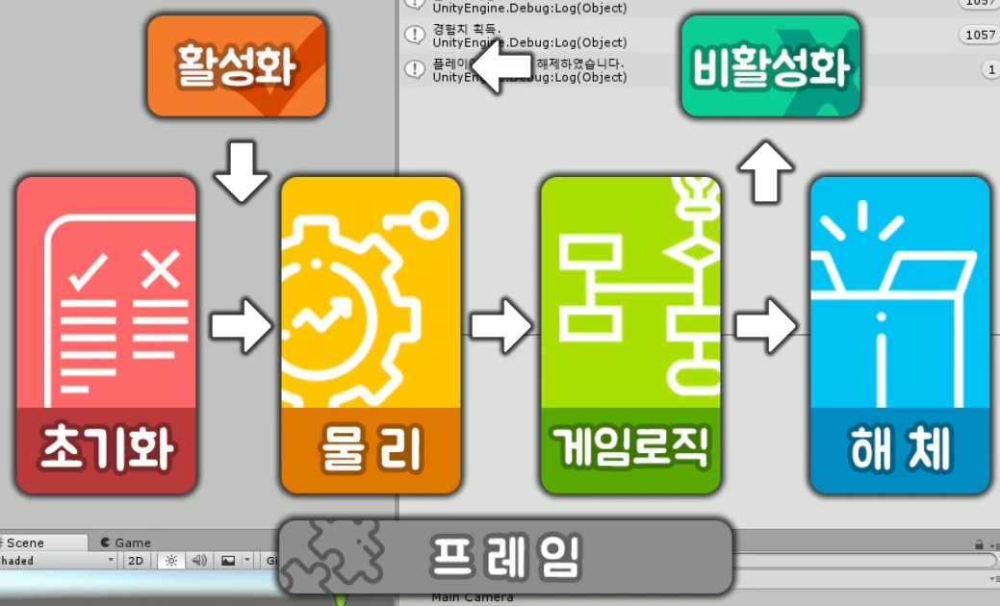

https://www.youtube.com/watch?v=PyN3JkPTpAI&list=PLO-mt5Iu5TeYI4dbYwWP8JqZMC9iuUIW2&index=6

unity lifecycle

## 초기화 영역

### Awake

게임 오브젝트 생성할 때, 최초 실행

### Start

업데이터 시작 직전, 최초 실행

## 물리 영역

### FixedUpdate

물리 연산 업데이트

(update: 1초에 여러 번 동작하는 함수.)

컴퓨터 성능에 거의 영향을 받지 않고, 고정된 실행 주기로 CPU를 많이 사용.

고정적으로 프레임 유지하고 있기 때문에, CPU 부하가 많다.

보통 1초에 50회

물리, 게임로직 -> 프레임

## 게임로직

### Update

게임 로직 업데이트

물리 연산에 관련된 연산을 제외한, 나머지, 주기적으로 변하는 로직을 넣을 때 사용하는 함수.

환경에 따라 실행 주기가 떨어질 수 있음.

60프레임으로 실행

지금은 FixedUpdate보다 많이 실행됨.

상황에 따라 FixedUpdate보다 더 실행될수도, 덜 실행될수도 있다.

### LateUpdate

모든 업데이트 끝난 후

캐릭터 따라가는 카메라 등 후처리

Update랑 (숫자가?) 같이 올라간다. (같이 실행된다.)

## 해제

### OnDestroy

게임 오브젝트가 삭제될 때

플레이어 실행시키고 나서, 

계층 구조에서 해당 플레이어 오브젝트를 삭제한다.

-> OnDestroy 진행됨.

사실 게임 오브젝트는 삭제를 하지 않고 켜고 끌 수 있다.

활성화, 비활성화라고 한다.

## 활성화

초기화, 물리 영역 사이에 위치하고 있다.

### OnEnable

게임 오브젝트가 활성화 되었을 때

Awake보다는 느리게, Start보다는 빠르게 실행된다.

이 둘과 다르게, 최초 1회 실행이 아닌, 키고끄고 할 때마다 실행된다.

## 비활성화

게임로직, 해체 사이에 존재한다.

모든 업데이트가 다 끝난 후에, 오브젝트가 비활성화 되거나 혹은 상태될 때(?) 실행된다.

### OnDisable

게임 오브젝트가 비활성화 되었을 때

인스펙터 객체 체크해제하면 비활성화 구현 가능.

체크하면 활성화 구현 가능.

