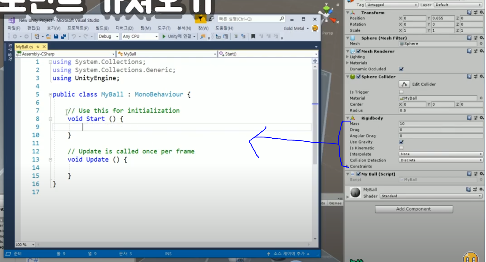

https://www.youtube.com/watch?v=h_MA36TGFsc&list=PLO-mt5Iu5TeYI4dbYwWP8JqZMC9iuUIW2&index=11


현실 세계에서 있을 법한 무게를 가진 물체를 만들어봤쥬?


실제로 힘을 줘서 물체를 움직여보자


이번 강좌는 **RigidBody** 컴포넌트에 집중!


Script 만들어서 안에서 함수를 호출하거나 해야 됨.


## 1. 컴포넌트 가져오기

코드 안에 MyBall의 Rigidbody component들을 변수로 담아야 한다.




```c#
    Rigidbody rigid; // 선언
    
    // Start is called before the first frame update
    void Start()
    {
        rigid = GetComponent<T>();
    }

    // Update is called once per frame
    void Update()
    {
        
    }
```


코드 흐름은 선언 -> 초기화 -> 호출

RigidBody

**GetComponent**<T>: 자신의 T 타입 컴포넌트를 가져옴.

이렇게 하면, MyBall의 Rigidbody component가 우리가 만든 변수 안에 스며들게 된다.


## 2. 속도 올리기

```c#
Rigidbody rigid; // 선언

// Start is called before the first frame update
void Start()
{
    rigid = GetComponent<T>();
    rigid.velocity = Vector3.right;
    // rigid.velocity = Vector3.left;
    
}

// Update is called once per frame
void Update()
{
    
}
```
게임을 시작하게 되면 알아서 right 방향으로 속력 이동


4:35


이런 식으로 velocity 줄 수도 있겠죠?

```c#
rigid.velocity = new Vector3(2, 4, 3);
```

y축 높이

마치 위에서 튀기듯이 튄다.


Q) 만약에 Update에서 호출한다면 어떻게 되나요?

Start -> 단 한 번만 실행된다.

Update에서 함 -> 계속 간다. 속도가 계속 유지된다.


rigid -> 물리 현상이기 때문에 Update가 아니다.

FixedUpdate에다가 써줘야 한다.

**RigidBody 관련 코드는 FixedUpdate에 작성!**


## 3. 힘으로 밀기

**addForce**(Vec): Vec의 방향과 크기로 힘을 줌.

**ForceMode**: 힘을 주는 방식 (가속, 무게 반영)

```c#
    Rigidbody rigid; // 선언

    // Start is called before the first frame update
    void Start()
    {
        rigid = GetComponent<Rigidbody>();
        rigid.AddForce(Vector3.up * 5, ForceMode.Impulse);
    }
```

Mass 무게 값이 클수록 움직이는 데 더 많은 힘이 필요.


이런 식으로 키를 입력할 때마다 점프도 가능.

```c#
    void FixedUpdate()
    {
        if (Input.GetButtonDown("Jump"))
		{
            rigid.AddForce(Vector3.up * 5, ForceMode.Impulse);
            // Debug.Log(rigid.velocity);
        }
    }
```

Jump같은 입력 뭐가 들어가야되는지 모르겠다.

-> Edit -> Project Setting

값 확인한다.


AddForce의 힘 방향으로 계속 속도 velocity가 증가.

누를수록 속도가 붙는다.

```c#
    void FixedUpdate()
    {
        if (Input.GetButtonDown("Jump"))
		{
            rigid.AddForce(Vector3.up * 5, ForceMode.Impulse);
        }
        Vector3 vec = new Vector3(
            Input.GetAxisRaw("Horizontal")
            , 0, Input.GetAxisRaw("Vertical")
            );
        rigid.AddForce(vec, ForceMode.Impulse);
    }
```

힘을 줘서 공을 굴릴 수 있다.


## 4. 회전력 주기

addTorque(Vec): Vec 방향을 축으로 회전력이 생김.

```c#
        // rigid.AddTorque(Vector3.back);
        rigid.AddTorque(Vector3.up);
```

위 - 굴러감

아래 - 제자리에서 돈다.

Vec를 축으로 삼기 때문에 이동 방향에 주의!

y=1 축으로 해서 돈다.

down 으로 하면 반대방향으로 돈다.

자유롭게 만들어서 갖고놀아보십셔

