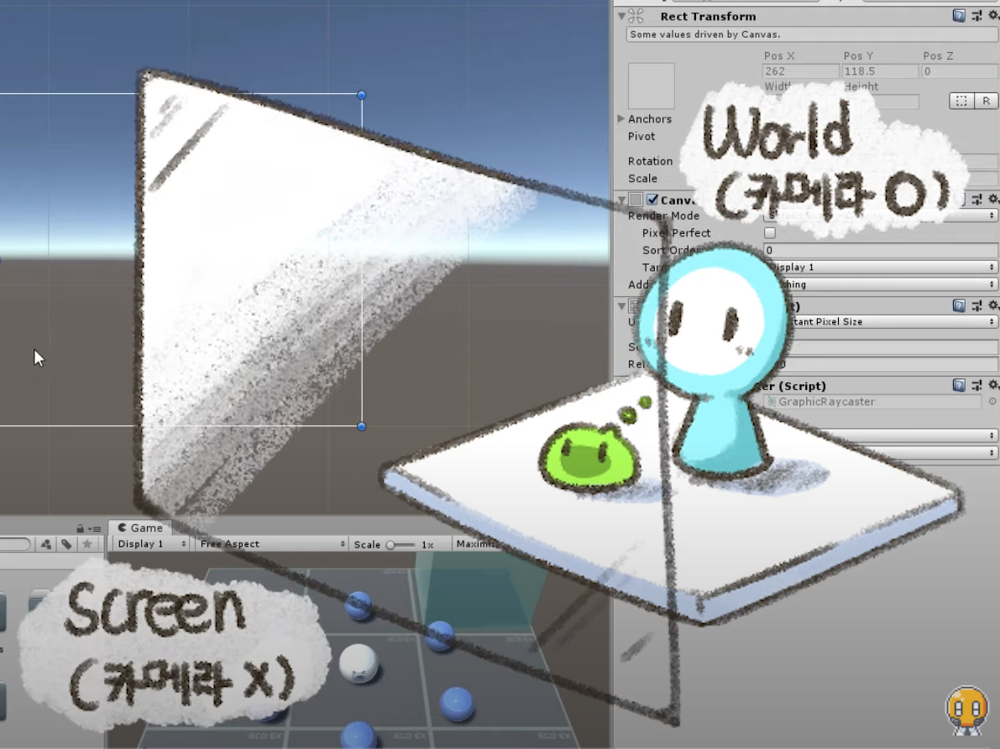

https://www.youtube.com/watch?v=k4YUJy-otDs&list=PLO-mt5Iu5TeYI4dbYwWP8JqZMC9iuUIW2&index=13


UGUI (Unity Graphic User Interface)


## 1. 캔버스

**Hierarchy**에서 우클릭 - **UI** - **Canvas** 클릭해서 만든다.


**Canvas**

UI가 그려지는 도화지 역할


하얀색 실선으로 표시된다.


Scene쪽 오른쪽 위에 조그만 버튼 2d가 있다.

누르면 2d 모양으로 카메라를 비춘다.

줌 바깥으로 쭉 땡기면.. 


### 2. 스크린

흰 사각형이 나온다.

**스크린**

게임이 표시되는 화면, 해상도로 크기 결정.




유니티에 좌표계 크게 두 개가 있다.

지금까지 봤던 World,

게임 창, 게임 윈도우, 게임 화면을 보여주는 화면 Screen.


마우스 커서도 스크린 좌표계에 포함된다.


캔버스에서 우리가 배워야 할 것들을 살펴보자.


## 3. 텍스트 UI

**Text**: 문자열을 표시하는 UI


**Hierarchy**의 **Canvas**에서 우클릭 - **UI** - **Text**

문자열을 입력할 수 있다.

한글 지원 된다.

Font도 있다.

주의) 폰트는 꼭 라이센스 확인!

폰트 사이즈 조절도 가능.


글자 잘릴 때

Horizontal Overflow

Wrap -> Overflow로 바꾸자.


Line spacing

줄 간격

1->2 하면 한 칸 띄워서 출력이 나온다.


Alignment로 정렬 가능.


VerticalOverflow도 있다.

overflow 쓰면 UI 깨지는 경우가 있기 때문에,

특수한 경우가 아니면 잘 사용하지 않는다.


하단의 Color에서 색깔 조절도 가능.


## 4. 이미지 UI

**Hierarchy**의 **Canvas**에서 우클릭 - **UI** - **Image**

source Image. Image 가져다놔야 한다.


이미지 **Project**에 Drag & Drop 후 클릭

이미지 클릭하면 **Texture Type**이 Default로 되어있을 것이다.

Default면 [선택한 이미지를] Image 안에 끌어놓을 수 없다.

이미지를 **Sprite**로 설정해야 UI 적용 가능.

**Apply**하신 다음에 쭉 드래그해서 **Source Image**로

짠 들어간다.


이미지 비율 안맞아서 깨질 수 있다.

하단의 Image Type - **Preserve Aspect** 체크

**Set Native Size** - 실제 크기로 맞춰준다.


**Image Type** 중요. 어떻게 이미지를 표현해주냐?

Simple - 그냥 들어감

Sliced - 이미지 잘라서 가운데 채워준다.

Tiled - 크기 고정, 이미지 component, transform에서 맞춰준 크기만큼 복사

Filled - 이미지 어떻게 채워지냐

​	Radial 360에서 Fill Amount 0~1 값 조절한다. 0에 가까워질수록 많이 사라진다.

Radial 360, 180, 90, Left, Bottom 등 여러가지 있다.

이미지 보여줄 때 어떤 방식으로 보여줄까 이 로직 쓰면 간편.


이미지 복사(이미지 누르고 Ctrl + d)

Color 조절로 살짝 어둡게 보여주기 가능


이미지 두 개 겹쳐놓고, 밝은 이미지에 Filled

Filled 기능으로 쿨타임 효과 구현 가능하다.


이미지 순서 바꾸고 싶으면 Hierarchy 순서 바꾸면 된다.

Canvas에서 가까울수록(위에 있을수록) 먼저 그린다.


UI는 Hierarchy의 순서에 따라 위 아래 결정.


## 5. 버튼 UI

**Hierarchy**의 **Canvas**에서 우클릭 - **UI** - **Button**


Button: 클릭 이벤트를 가지고 있는 반응형 UI


가에 있는 것들이 원본이고 중앙쪽은 쭉 늘린 것이다.

Fill center하면 중앙쪽에 늘린 것들 사라져서 원본이 나온다.

Sliced 기능으로 자유자재 크기로 이미지 구현 가능.


Button - Interactable

반응할지말지 알려줌

체크 해제하면 버튼 무용지물이 된다.


**Transition** None 제외하고 세 가지 방법 있다.

마지막 Animation 어려워서 패스

**Color Tint** - 색깔을 바꿔준다.

​	Normal Color - 가만히 있을 때

​	Highlighted Color - 마우스 올려놨을 때

​	Pressed Color - 마우스 눌렀을 때

​	Disabled Color - 이 버튼이 비활성화되었을 때


Color Multiplier 색 섞는건데 보통 1로 둔다.


Navigator 보통 웹에서 탭을 누르면 아래에서 UI가 선택된다.

여기도 가능하다.

탭 키를 누르면 옆으로 갈꺼냐, 위로 갈꺼냐, 자동으로 선택할꺼냐 결정한다.


가장 중요한 OnClick 이벤트 보자

**OnClick**

버튼 클릭 시 호출되는 이벤트 함수


클릭하면 어떤 이벤트, 어떤 코드가 실행될 것이냐

`+` 눌러서 Hierarchy에 있는 MyBall 집어넣자.


MyBall.cs에서 하나 더 만들어보자.

```c#
    public void Jump()
	{
        rigid.AddForce(Vector3.up * 20, ForceMode.Impulse);
    }
```


버튼 선택 후 On Click - Runtime Only옆 No Function 클릭 - MyBall - 

방금 우리가 작성했던 Jump() 클릭 [public 아니면 안 보인다.]


버튼 클릭은 누르기-떼기 한 세트 동작.


나는 모서리에 배치했는데, 화면 중앙에 버튼이 왔다..

이걸 잡아보자.


## 6. 앵커

이미지 등 클릭 - Rect Transform

왼쪽 위 빨간색 십자가 클릭

Anchor Presets

Anchor 어느 한 곳을 잡아서 그것과의 거리 유지

현재 중앙, 중심점


왼쪽 위로 맞추고싶다 - Anchor 왼쪽 위 선택 후,

**Pos X, Pos Y**를 0으로 한다.

잘 안맞음 -> **Anchor** 왼쪽 위 선택할 때 **Shift**를 누른 채로 선택한다.

파란색 점이 생겼쥬?

다시 해보면 정확하게 삭 맞는다.


앵커-파란점: 컴포넌트에서의 기준점. (Shift)


앵커 **위치 선택**할 때 **Shift + Alt** 하면 위치까지 알아서 맞춰준다.


앵커-중앙네모: 컴포넌트의 위치. (Alt)

