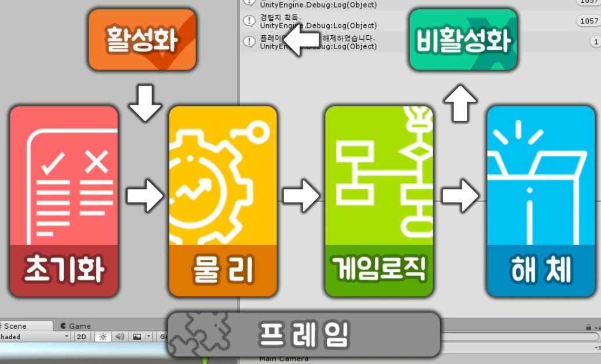

유니티 강좌 기초 채널 Basic

By 골드메탈 님

https://www.youtube.com/playlist?list=PLO-mt5Iu5TeYI4dbYwWP8JqZMC9iuUIW2

- ### 목표

Unity에 대한 전반적인 이해

프로젝트 진행 시 3d 게임 구현에 기반이 될 지식 학습

- ### 학습 계기

AI 관련 특화 프로젝트에서, 3d 게임을 만들기 위한 사전 학습.

모 학우의 github를 보고 따라하고 싶은 마음이 생겼다.

### 

### 추가로 도움을 받은 사이트 모음

https://assetstore.unity.com/

### 강의 요약

- 1강

설치 방법

- 2강

유니티 에디터

4개의 창으로 구성

- 프로젝트

  게임을 구성하는 파일들, 그래픽, 사운드 모두 프로젝트 창에 들어간다.

  

- 계층구조

  게임 오브젝트를 확인하거나, 직접 만들 수 있다.

  

- 장면

  게임 오브젝트는 장면 창에서 우리 눈에 보이게 된다.

  

- 인스펙터

  게임 오브젝트들을 선택하게 되면, 인스펙터 창에서 속성들을 확인할 수 있다.

  

- 사물 조절하기, 시점 변화

- 3강

연극 > 막 > 인물&소품 > 대본

게임 > 장면 > 오브젝트 > 스크립트

유니티는 C# 사용

- 4강

[self] 꿀팁) .cs 파일 vscode와 연동시키기

프로그래밍 학습에 앞서 준비물 챙겨보고 메시지 띄워보자.

첫 번째 준비물: C# 스크립트

두 번째 준비물: 비주얼 스튜디오

세 번째 준비물: 콘솔창

- 5강

C# 스크립트 기초 문법

변수

그룹형 변수

배열

리스트

연산자

키워드

조건문

반복문

함수(메소드)

클래스

- 6강

unity lifecycle

## 초기화 영역

### Awake

게임 오브젝트 생성할 때, 최초 실행

### Start

업데이터 시작 직전, 최초 실행

## 물리 영역

### FixedUpdate

물리 연산 업데이트

(update: 1초에 여러 번 동작하는 함수.)

CPU 부하가 많다.

보통 1초에 50회

물리, 게임로직 -> 프레임

## 게임로직

### Update

게임 로직 업데이트

물리 연산에 관련된 연산을 제외한, 나머지, 주기적으로 변하는 로직을 넣을 때 사용하는 함수.

### LateUpdate

모든 업데이트 끝난 후

캐릭터 따라가는 카메라 등 후처리

## 해제

### OnDestroy

게임 오브젝트가 삭제될 때

## 활성화

초기화, 물리 영역 사이에 위치하고 있다.

### OnEnable

게임 오브젝트가 활성화 되었을 때

## 비활성화

게임로직, 해체 사이에 존재한다.

모든 업데이트가 다 끝난 후에, 오브젝트가 비활성화 되거나 혹은 상태될 때(?) 실행된다.

### OnDisable

게임 오브젝트가 비활성화 되었을 때

- 7강

### 키보드, 마우스 입력

**Input**

게임 내 입력을 관리하는 클래스

**anyKeyDown**

(Input.anyKeyDown)

아무 입력을 최초로 받을 때 true

**anyKey**

아무 입력을 받으면 true

누를 떼마다 계속

**GetKey**

키보드 버튼 입력을 받으면 true

**GetKeyDown**

**GetKeyUp**

마우스도 똑같다.

마우스로 바꾸면 돼

**GetMouse**

마우스 버튼 입력을 받으면 true

**GetMouseButtonDown**

**GetMouseButton**

**GetMouseButtonUp**

**Horizontal**

수평이란 의미. 수평이동

**Vertical**

종이동, 위아래 이동

**GetButton**

Input 버튼 입력을 받으면 true

**GetAxis**

수평, 수직 버튼 입력을 받으면 float

**GetAxisRaw**

오브젝트는 변수 transform을 항상 가지고 있음.

왼쪽 -1, 오른쪽 1 [소숫값 이동 없음]

중간값 포함하고 싶으면 GetAxis

### 오브젝트 이동

**Transform**

오브젝트 형태에 대한 기본 컴포넌트

Transform, object 1:1관계이다.

아무리 빈 거라도 위치, 회전, 크기 있다.

**Translate**

벡터 값을 현재 위치에 더하는 함수.

마우스 막 안움직이고도 code로,

**Vector3**와 **Translate** 두 가지만 써서 손쉽게 Object를 움직일 수 있다.

Translate 말 그대로 이동을 한다!

- 8강

목표 지점으로 이동하는 방식 공부

**MoveTowards**

등속 이동

매개변수는 (현재위치, 목표위치, 속도)로 구성

마지막 매개변수에 비례하여 속도 증가

**SmoothDamp**

부드러운 감속 이동

매개 변수는 (현재위치, 목표위치, 참조 속도, 속도)

마지막 매개변수에 반비례하여 속도 증가

**Lerp**

선형 보간, SmoothDamp보다 감속시간이 김

마지막 매개변수에 비례하여 속도 증가 (최대값 1)

**SLerp**

구면 선형 보간, 호를 그리며 이동

- 9강

델타타임

좋은 컴퓨터이든 나쁜 컴퓨터이든 [프레임 많던 적던] 같은 시간 내 동일한 거리 이동 도와줌.

**Time.deltaTime 사용하는 방법**

Translate: 벡터에 곱하기

transform.Translate(Vec * Time.deltaTime);

Vector 함수: 시간 매개변수에 곱하기

Vector3.Lerp(Vec1, Vec2, T * Time.deltaTime);

### Time.deltaTime

이전 프레임의 완료까지 걸린 시간

- 10강

현실 세계와 같은 실제 물체 만들기

### 중력 적용하기

**RigidBody**

물리효과를 받기 위한 컴포넌트

### 충돌 영역 정하기

**Collider**

물리 효과를 받기 위한 컴포넌트

**RigidBody**

​	Mass

​	Use Gravity

​	Is Kinematic

​		외부 물리효과를 무시. 함정 만들 때 유용하다.

### 재질 만들기

**Material**

​	Albedo

​		색깔 선택

​	Metalic

​		금속 재질 수치, [0 ~ 1]

​	Smoothness

​		빛 반사 수치, [0 ~ 1]

​	Texture

​		재질에 들어가는 이미지

​	Tiling

​		텍스쳐 반복 타일 갯수

​	Emission

​		텍스쳐 발광(밝기) 조절

### 물리 재질 만들기

**Physic Material**

탄성과 마찰을 다루는 물리적인 재질

**Bounciness**

탄성력, 높을수록 많이 튀어오름.

**Bounciness Combine**

다음 탄성을 계산하는 방식

**Friction**

마찰력, 낮을수록 많이 미끄러짐

​	Static Friction - 정지했을 때 마찰력

​	Dynamic Friction - 움직일 때 마찰력

**Friction Combine**

다음 마찰력을 계산하는 방식.

### 물체 필수 요소

Mesh[점, 폴리곤, UV를 관리하는 구조체], Material[재질], Collider[물리 효과를 받기 위한 컴포넌트], RigidBody[물리 효과를 받기 위한 컴포넌트]

- 11강

실제로 힘을 줘서 물체를 움직여보자

컴포넌트 가져오기

​	**GetComponent**<T>: 자신의 T 타입 컴포넌트를 가져옴.

속도 올리기

​	rigid.velocity = new Vector3(2, 4, 3);

​	rigid -> 물리 현상이기 때문에 Update가 아니다.

​	**RigidBody 관련 코드는 FixedUpdate에 작성!

힘으로 밀기

​	**addForce**(Vec): Vec의 방향과 크기로 힘을 줌.

​	**ForceMode**: 힘을 주는 방식 (가속, 무게 반영)

회전력 주기

​	addTorque(Vec): Vec 방향을 축으로 회전력이 생김.

- 12강

물리 충돌 이벤트

오브젝트의 재질 접근은 **MeshRenderer**를 통해서

**CollisionEnter**

물리적 충돌이 시작할 때 호출되는 함수

**CollisionExit**

물리적 충돌이 끝났을 때 호출되는 함수

트리거 이벤트

**TriggerStay**

콜라이더가 계속 충돌하고 있을 때 호출

## 정리

// 실제 물리적인 충돌로 발생하는 이벤트

void OnCollisionEnter(Collision collision) {}

void OnCollisionStay(Collision collision) {}

void OnCollisionExit(Collision collision) {}

// 콜라이더 충돌로 발생하는 이벤트

void OnTriggerEnter(Collider other) {}

void OnTriggerStay(Collider other) {}

void OnTriggerExit(Collider other) {}

- 13강

UGUI (Unity Graphic User Interface)

캔버스 **Canvas**

​	UI가 그려지는 도화지 역할

​	**Hierarchy**에서 우클릭 - **UI** - **Canvas** 클릭해서 만든다.

스크린

​	게임이 표시되는 화면, 해상도로 크기 결정.

텍스트 UI

​	문자열을 표시하는 UI

​	**Hierarchy**의 **Canvas**에서 우클릭 - **UI** - **Text**

이미지 UI

​	source Image. Image 가져다놔야 한다.

​	**Hierarchy**의 **Canvas**에서 우클릭 - **UI** - **Image**

버튼 UI

​	클릭 이벤트를 가지고 있는 반응형 UI

​	**Hierarchy**의 **Canvas**에서 우클릭 - **UI** - **Button**

​	Button - Interactable

​		반응할지말지 알려줌

​		체크 해제하면 버튼 무용지물이 된다.

​	**Color Tint** - 색깔을 바꿔준다.

​		Normal Color - 가만히 있을 때

​		Highlighted Color - 마우스 올려놨을 때

​		Pressed Color - 마우스 눌렀을 때

​		Disabled Color - 이 버튼이 비활성화되었을 때

​		

​	가장 중요한 OnClick 이벤트 보자

​	**OnClick**

​		버튼 클릭 시 호출되는 이벤트 함수

​		클릭하면 어떤 이벤트, 어떤 코드가 실행될 것이냐

앵커

​	이미지 등 클릭 - Rect Transform

​	왼쪽 위 빨간색 십자가 클릭

​	Anchor Presets

​	Anchor 어느 한 곳을 잡아서 그것과의 거리 유지

​	현재 중앙, 중심점

​	왼쪽 위로 맞추고싶다 - Anchor 왼쪽 위 선택 후,

​	**Pos X, Pos Y**를 0으로 한다.

​	잘 안맞음 -> **Anchor** 왼쪽 위 선택할 때 **Shift**를 누른 채로 선택한다.

​	앵커 **위치 선택**할 때 **Shift + Alt** 하면 위치까지 알아서 맞춰준다.

- 14강

예제 모아서 게임 만들기

- [1. 계획하기]
- [2. 플레이어
- [3. 아이템]
- [4. 카메라]
- [[5. 결승점]
- [6. 장면 이동]
- [7. 스테이지]
- [8. UI]
- [Build]

